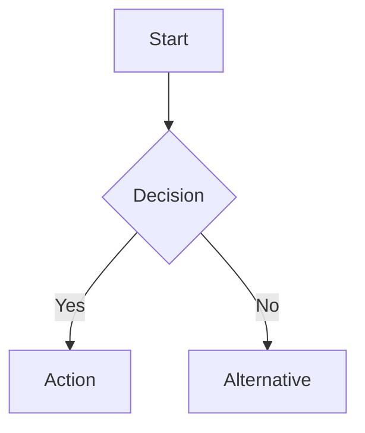
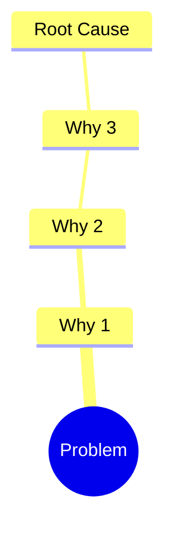

# 📄 Document Findings

Take research output and produce structured, enhanced markdown documentation.

## 📥 Inputs

1. **Project path** – `work/{company}/{job}/`
2. **Source material** – Research output from the learn skill (README.md content, including Level-0 job post and findings).
3. **Document type** – One of: `research`, `analysis`, `solutions`, `project-overview`

If the project path or source material is missing, ask the user before proceeding.

Valid company and job values are defined in `work/config.md` (Paths table: Company | Job).

## 📤 Output

1. **Job post copy** – Create `work/{company}/{job}/job-post.md` with the full job post content (the Level-0 input from the learn output). This is a direct copy of the job listing for reference when drafting applications.
2. **README** – `work/{company}/{job}/README.md`. Structured documentation (role summary, requirements, application process, link tree). When you discover or document new topics, add them to this README. Do not create other notes or drafts; use this single README plus job-post.md.

## 📐 Markdown Standards

### 📌 Headings
Use H2 (`##`) as top-level within documents. Reserve H1 (`#`) for the document title only. **Use an emoji in every H2 and H3** in the README (e.g. ## 📋 Role summary, ### 📊 Project tracking).

### 📊 Mermaid Diagrams

Use mermaid for:
- **Flowcharts** - Processes, workflows, decision trees
- **Sequence diagrams** - Multi-step interactions
- **Mind maps** - Problem breakdowns, topic relationships
- **Gantt charts** - Timelines, phases

Example for a workflow:
````markdown

````

Example for root cause:
````markdown

````

### 📋 Tables
Use tables for structured comparisons, source indexes, and feature matrices. Only add rows when source material provides real data. Never add placeholder rows, TBD, example data, or made-up names/dates/artifacts.

### 💬 Callouts
Use blockquotes with bold labels for callouts:
```markdown
> **Note:** Additional context here.

> **Warning:** Risk or caveat here.
```

### 🔗 Links and Sources
Always cite sources inline with markdown links. Group full source lists in tables.

**Clickable links:** Every reference to a source or URL must use markdown link syntax `[title](url)` so it renders as a clickable link in the README. Never write the link title and URL as separate plain text or as a bare URL.

**Link everything that can be linked.** Do not leave linkable items as plain text. In scope:
- **Sections:** Include a full table of contents after the --- divider (see README structure) linking to every H2 and H3 so readers can jump to any section.
- **URLs:** Use `[title](url)` for every source, doc, or external reference.
- **People:** In Project tracking > Team, give each person a document anchor (`<a id="jane-doe"></a>` before the name, or a heading). Anywhere that person appears (notes, Audits, Deliverables, Artifacts, etc.), link their name to that anchor (`[Jane Doe](#jane-doe)`).
- **Tickets:** When a ticket ID or URL exists, link it (e.g. `[ICT-123](url)` or link the ID).
- **Job post:** The copy lives in `job-post.md` in the same folder as the README; link to it from README when relevant.
- **Artifacts / docs:** If an artifact or doc has a URL, link it.

When in doubt, add the link.

## ⚙️ Process

### 1. 📖 Read Source Material
Read the project README (learn skill output) from the source path. Identify Level-0 (job post) content and Findings.

### 1b. 📁 Merge work research (if present)
If `work/{company}/{job}/work-research.md` exists: read it, add an **📁 Existing work** section to the README (after Application process or before Sources). Include the work-research content (existing applications, work history summary, relevant experience). Update the README table of contents to link to it. Then delete work-research.md.

### 1c. 📄 Place final resume at top (if present)
If `work/{company}/{job}/resume-alignment.md` exists: place its full content at the **very top** of the README (before anything else). Then add a horizontal rule `---` immediately after the resume. Then ensure the document has a **table of contents** right after the --- linking to every H2 and H3 in the rest of the document. All content below the --- (role summary, requirements, existing work, sources, link tree, etc.) stays under that. Use emoji in every section header below the ---. Then delete resume-alignment.md.

### 2. 📋 Create Job Post Copy
Write the full job post content to `work/{company}/{job}/job-post.md`. Use the Level-0 (input) section from the learn output. Preserve formatting and structure so it is a usable reference for drafting applications.

### 3. 📑 Organize by Sections
Map content into the README sections based on document type.

### 4. ✍️ Write README
- If resume-alignment content was placed at top, the README starts with that, then ---, then title and navigation.
- After the --- (or at start if no resume): add a clear title (H1) and a **full table of contents** linking to every H2 and H3 so readers can navigate to all sections.
- Use an **emoji in every H2 and H3** (e.g. ## 📋 Role summary, ## ✅ Requirements).
- Use mermaid diagrams where relationships or flows exist.
- Use tables where comparisons or indexes exist (e.g. requirements list).
- Keep paragraphs short (3-4 sentences max).
- Cite sources inline.

### 5. 📐 README structure

**For job applications** (when source is learn output for a job post), use this structure. **Order:** (1) Final resume content at very top if resume-alignment.md was merged, (2) horizontal rule `---`, (3) H1 title, (4) full table of contents linking to every H2 and H3 below, (5) sections with emoji in every header. Only include sections for which source material provides real data; no placeholders or made-up content.

```markdown
[Optional: full final resume content from resume-alignment when present]

---

# {Role Title} at {Company}

- [📋 Role summary](#role-summary)
- [✅ Requirements](#requirements)
- [📌 Responsibilities](#responsibilities)
- [📮 Application process](#application-process)
- [📁 Existing work](#existing-work)
- [🔗 Sources](#sources)
- [🌐 Link tree](#link-tree)
(Include only sections that exist; link to every H2 and H3 in the doc.)

---
## 📋 Role summary
One-line role, level, location, and key focus from the job post.

## ✅ Requirements
Bullets or table of must-haves and nice-to-haves from the post.

## 📌 Responsibilities
Key responsibilities and focus areas.

## 📮 Application process
How to apply, link, deadlines, any instructions.

## 📁 Existing work
Past applications (company | job | key points), work history summary, and relevant experience from work/ refs. Only when work-research was merged.

## 🔗 Sources
Table of crawled links (URL | Depth | Title). Every URL as [title](url).

## 🌐 Link tree
Traversal map from learn output. Every item as [title](url).
```

**For other document types** (analysis, solutions, project-overview), use the structure below. Full navigation at the top: after the H1 title, add a table of contents that links to every H2 and H3. **Use an emoji in every H2 and H3.** Section headers below describe what goes in each place when source material provides it; do not populate with placeholder or made-up data.

```markdown
# {Project Name}

- [🔍 Discovery](#discovery)
  - [📊 Project tracking](#project-tracking)
  - [📋 Audits](#audits)
  - [👥 Users + Needs](#users--needs)
- [💡 Exploration](#exploration)
  - [💡 Ideation](#ideation)
  - [📎 Artifacts](#artifacts)
  - [✅ Validation](#validation)
- [🚀 Go to market](#go-to-market)
  - [📦 Deliverables](#deliverables)
  - [📈 Performance](#performance)
  - [🔄 Next version](#next-version)
(Include only sections that exist; link every H2 and H3.)

---
## 🔍 Discovery

### 📊 Project tracking
- **Team:** One row per person. Name = individual contributor (person's full name, not team or space). Responsibility = exactly one of: **Driver**, **Approver**, **Contributor**, **Informed** (DACI only; no other values). Example: ticket assignee (Ryan Allen on the UX ticket) is **Contributor**; the person who assigned the ticket is at least **Informed** (and may also be Driver, Approver, or Contributor).
- **Roadmap:** Project + ticket | Due date.
- **Measurements:** Name | Current state | Desired state.

### 📋 Audits
Notes, current-state review, competitor review. Track artifacts in Exploration > Artifacts. When source material includes a **Link tree** or **Sources** section (from learn output), preserve it here: include a "Link tree" subsection with the full traversal map and a Sources table when useful so every crawled link remains in the README.

### 👥 Users + Needs
Users raw & encoded needs (User | Time/date | Verbatim | Encoded needs). Sorted needs. Refined problem statement (In which way might we enable ${user} to solve ${mainNeed1} & ${mainNeed2}, to ${userGoal} & ${businessGoal}?).

---
## 💡 Exploration

### 💡 Ideation
Hypotheses (If | then | due to).

### 📎 Artifacts
Artifacts table (Date | Creator | Artifact). Drawings, surveys, flow charts, prototypes, UI, code repos. **Design files:** physical design files (Figma, Sketch); link or list with Creator and Artifact.

### ✅ Validation
Test plan (general, users, goals). User testing results (Version | KPI 1 | KPI 2).

---
## 🚀 Go to market

### 📦 Deliverables
Designs for engineers (Date | Creator | Artifact). Production roadmap (Project name | Due date | Status | Person assigned).

### 📈 Performance
Quality assurance. Production testing (Version | KPI 1 | KPI 2).

### 🔄 Next version
Learnings. Recommendations. Links to new docs.
```

## 📌 Rules

- Never use absolute filesystem paths in links. All links must be relative to the document they appear in
- Never invent information not present in source material. No placeholder or made-up content anywhere: no fake table rows, no TBD, no example names/dates/artifacts in Deliverables, Project tracking, Roadmap, or any other section. Only real data from source material; leave sections or tables empty when there is nothing to put.
- In Project tracking > Team: Name must be an individual person (full name). Responsibility must be exactly one of Driver, Approver, Contributor, Informed (DACI). No other roles or labels.
- When structuring from research that includes a Link tree or Sources section, preserve them in the README (under Sources and Link tree, or under Discovery > Audits for non-job doc types) so the full link tree is always present
- Always attribute content to its source
- Use mermaid diagrams for any process with 3+ steps or any hierarchy with 2+ levels
- Always include a full table of contents after the --- (or after H1 if no resume at top): link to every H2 and H3 section so readers can navigate to all parts of the document
- Use an emoji in every H2 and H3 heading in the README output
